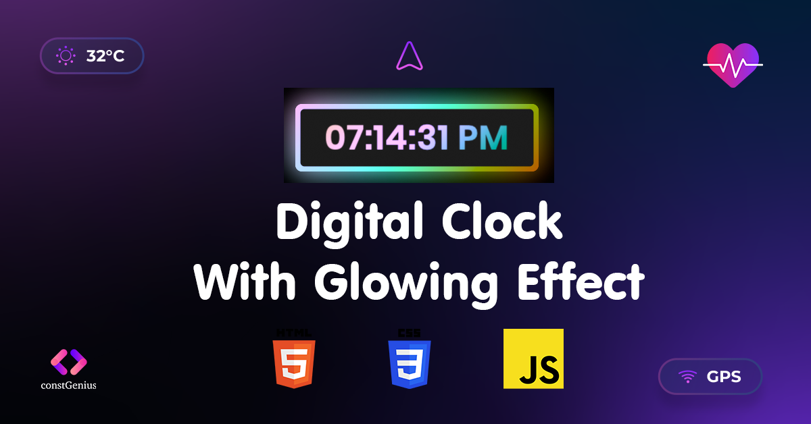

# Digital Clock With Glowing Effect
This is a simple project that demonstrates how to create a digital clock with a glowing effect using HTML, CSS, and JavaScript. The digital clock displays the current time and features a subtle glowing animation that adds a visual appeal to the design.

Youtube Tutorial Video: https://youtu.be/Jw22NmPKbkA

Live Preview: https://constgenius.github.io/DigitalClockWithGlowingEffect/

